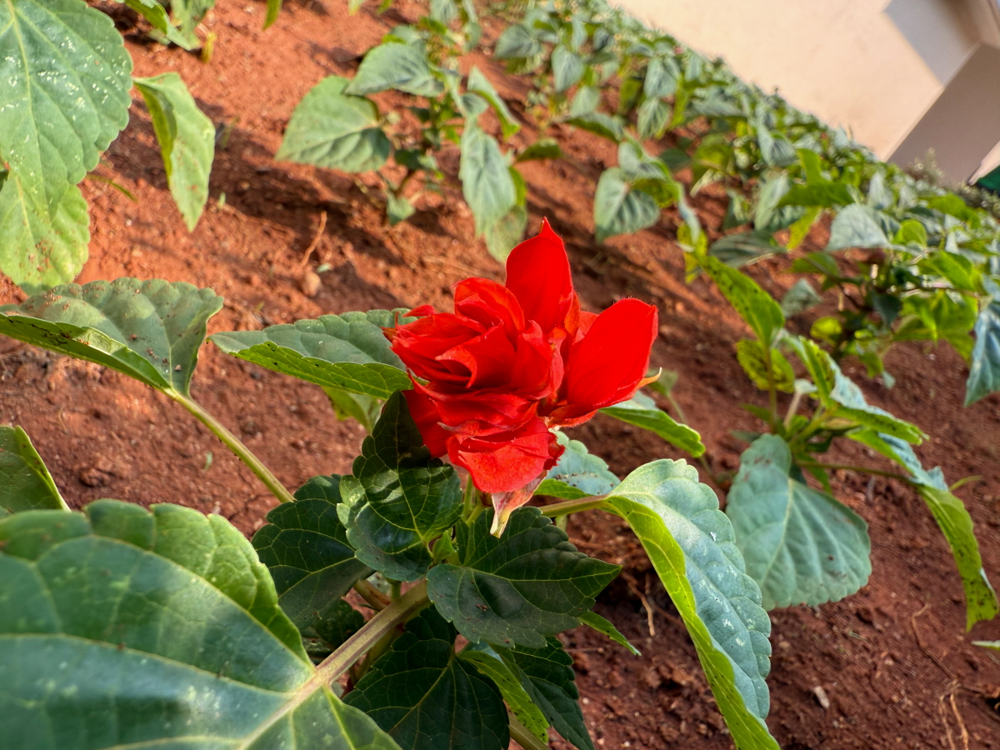

# 20250218_chiangrai

<html>
<head>

<meta charset="UTF-8">
<meta http-equiv="Content-Type" content="text/html; charset=UTF-8">
<meta http-equiv="X-UA-Compatible" content="IE=EmulateIE10" />
<meta http-equiv="X-UA-Compatible" content="IE=edge">

<!--ここから上はお決まりの定型文です-->

<!--ここからが表現の書式などを決めるcssという部分-->

<link href="https://cdnjs.cloudflare.com/ajax/libs/lightbox2/2.7.1/css/lightbox.css" rel="stylesheet">

</head>

<body>

モバイル端末をお使いの場合は、画面を横向きにすると
より見やすくご覧頂けます。

<!--ここ上は、ほぼそのまま使います！-->

<!--QRコードの挿入例-->

 アクセス用QRコード

<marquee direction="left" scrollamount="20" width="30%">(^_^)/~alis</marquee>

<!--流れ文字の挿入例-->
<h1><marquee behavior="left">!!! 2025/02/18、買い物していつものプール、火曜木曜、限定開催の市場で尼僧さん目撃!!!</marquee></h1>

                          

<!--ここから下が、本体部分-->

<h2>曇り空の夜明け 朝7:19</h2>

    
<h2>天使の梯子は上に伸びました</h2>

    
<h2>太陽周辺の雲はオレンジ色</h2>

    
<h2>ランのお花に朝日が当たって輝きます</h2>

    
<h2>義妹のBENZ、昨日買ったカーシャンプーで虫を落としました 残念ながら銀行に取られる運命・・・とほほ</h2>

    
<h2>ローカルFM放送がpm注意報出してます。空がどんよりしてますね〜</h2>

    
<h2>タイのネットバンキングはイマイチ危なそうなので、現金のやり取りには銀行に赴きます</h2>

    
<h2>現金握りしめて、そばの市場ですぐ買い物</h2>

    
<h2>国道を南下して不法入国者チェックの検問を通過</h2>

    
<h2>大学は授業中なのでプールはガラガラ</h2>

    
<h2>管理棟前の花壇の植え込みが伸びてきました</h2>

    
<h2>真っ赤なお花が一輪だけ早咲き</h2>

    
<h2>学内は異様に広いので、学生さん達はバイクで移動</h2>

    
<h2>大学入り口のオブジェを後ろから撮影</h2>

    
<h2>セブンイレブンでアイス、真ん中の黄色は15バーツ（約68円）</h2>

    
<h2>火木のみ開催の郊外の市場に行きました</h2>

    
<h2>市場に尼僧さんが居ました、ここでは初めて見たかも・・・</h2>

    
<h2>川魚２尾購入、100バーツ</h2>

    
<h2>肉の切り売りするお姉さんが、すごい迫力</h2>

    
<h2>尼僧さん、師弟で来られている様でした</h2>

    
<h2>タイの犬は基本放し飼いで、市場の中でもおこぼれ狙ってウロウロ</h2>

    
<h2>HONDAバイクの販促イベント中でした</h2>

    
<h2>夕焼けはオレンジから始まって一瞬むらさきに</h2>

<h2>前日の盛大なむらさきグラデーションも比較で載せておきます</h2>

    
<h2>冬の星空はもともと派手ですが、火星と木星が入り込んで一段と賑やか</h2>

    
<h2>冬のダイアモンドをトレースしました 夜20:04</h2>

  
<h2>今日のBGMは 日本語と英語のスペシャルブルースミックス｜心に響く歌 2025</h2>
<iframe width="560" height="315" src="https://www.youtube.com/embed/dZLERMIhQH4?si=uEuSq8lMv_DhK3XZ" title="YouTube video player" frameborder="0" allow="accelerometer; autoplay; clipboard-write; encrypted-media; gyroscope; picture-in-picture; web-share" referrerpolicy="strict-origin-when-cross-origin" allowfullscreen></iframe> 

  
<h2>タイにいるからなのか、仏教系の動画が出てくるのでこちらにもアップ 思い違いかもしれないけど、呼吸法と修行って、水泳のインターバル練習に似てると思うのは気のせいか？</h2>
<iframe width="560" height="315" src="https://www.youtube.com/embed/SBhV9acp6Xo?si=2JTmAjYCAny271Vp" title="YouTube video player" frameborder="0" allow="accelerometer; autoplay; clipboard-write; encrypted-media; gyroscope; picture-in-picture; web-share" referrerpolicy="strict-origin-when-cross-origin" allowfullscreen></iframe> 

   
<h2>以上、市場で買い物する尼僧さん初めて見ました。一般人とは違うオーラ出てますね。 ここまでご覧いただきありがとうございました。</h2>

     
<h2>
<a href="https://torokoid.github.io/20241126_chiangrai/" target="_blank">Back to the menu page</a>
</h2>

   

         

  

      

<!--本体はここまで-->

<!--画面に空白地帯を作って、背景が見えるようにしています-->
                                              

<!-- フッタ -->
<footer>

Copyright 2025/02/19 alis @ChiangRai

</footer>

<!--HPにさまざまなJavaScriptを呼び込むための書式-->

    
    </body>
    
</html>
